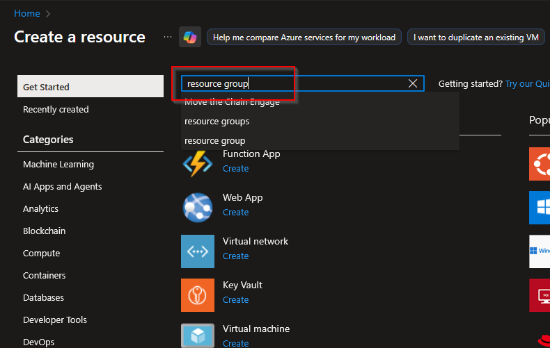
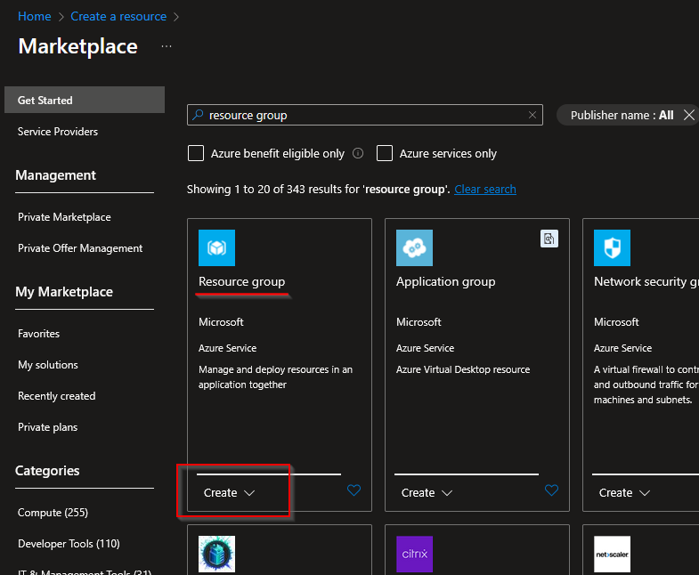
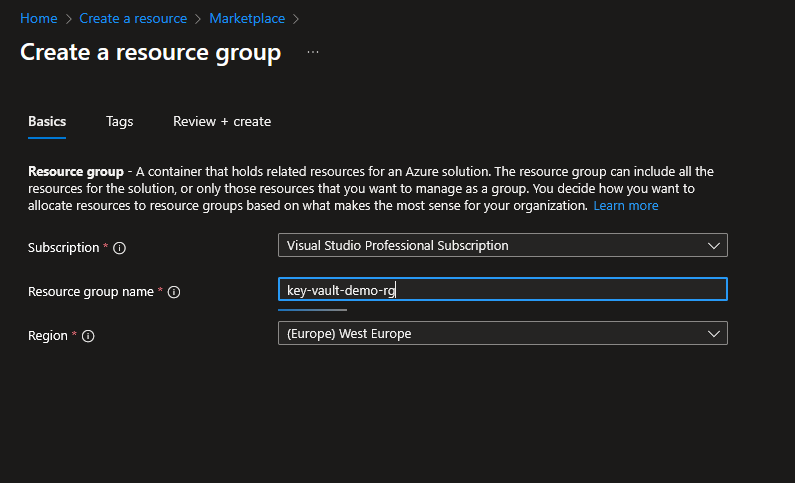

# I) Create the Resource Group

## 1) Access the Azure Portal

- `https://portal.azure.com`

## 2) Create a resource

## 3) Choose "Resource group"

Search for "resource group"

Choose to create a new resource group

## 4) Configure

### Basic

- Choose the Subscription (I am using the "Visual Studio Professional Subscription")
- Choose a name for the new resource group: `key-vault-demo-rg`
- Key vault name: `key-vault-20251022-kv`
- Region: `West Europe`
  - Make sure it is the same region as the resource group

### Review + create

- Click "Create" button