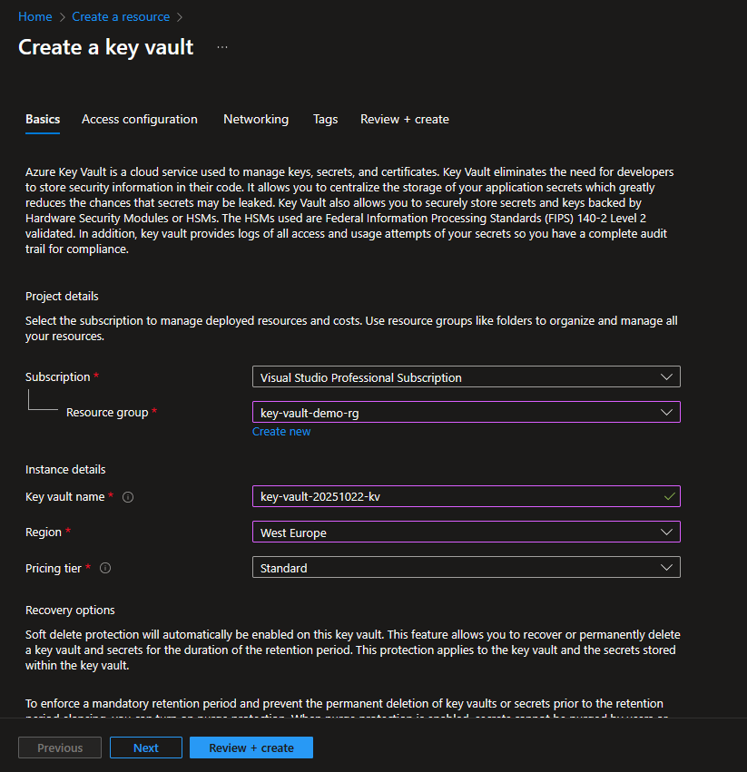

# II) Create the Key Vault

## 1) Access the Azure Portal

- `https://portal.azure.com`

## 2) Create a resource

## 3) Choose "Key Vault"

## 4) Configure

### Basic

- Choose the Subscription (I am using the "Visual Studio Professional Subscription")
- Choose the resource group: `key-vault-demo-rg`
- Key vault name: `key-vault-20251022-kv`
- Region: `West Europe`
  - Make sure it is the same region as the resource group

### Access configuration

- Permission model: `Azure role-based access control (Azure RBAC)`

### Networking

- Accept default values

### Review + create

- Click "Create" button

