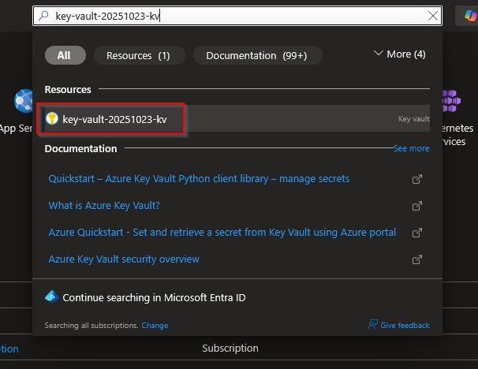
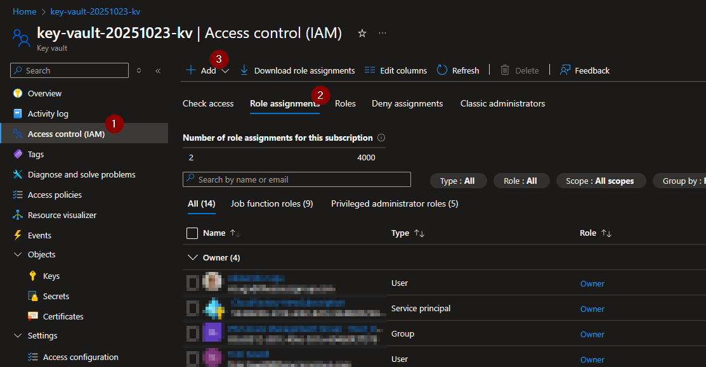
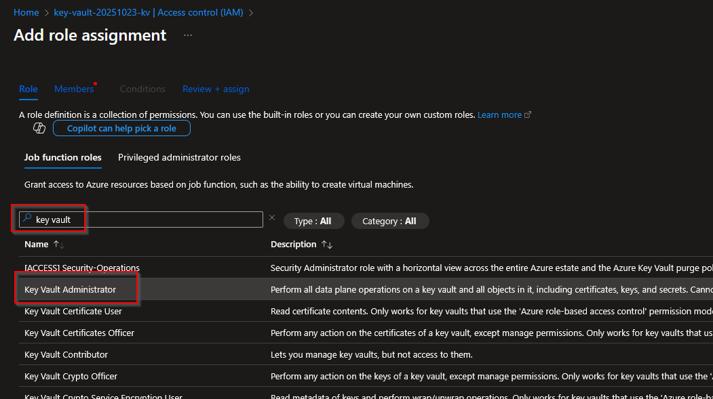
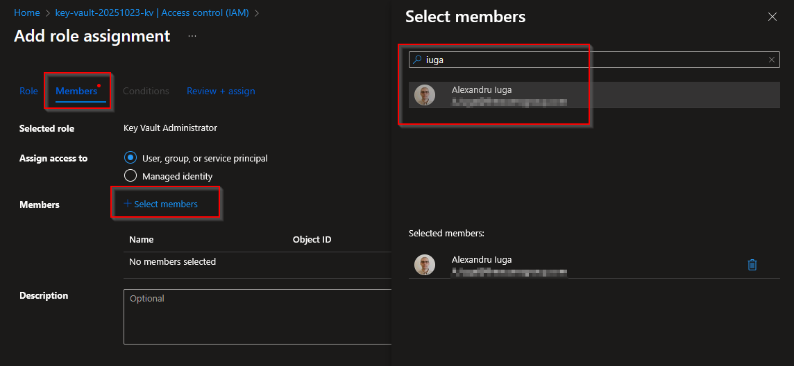

# III) Assign Permissions

## 1) Access the Azure Portal

- `https://portal.azure.com`

## 2) Search for the Key Vault

In the top search bar enter the key vault name created earlier and open it:

## 3) Access control (IAM)

Go to "Access control (IAM)" --> "Role Assignment" tab -> click "Add"

Search for "Key Vault Administrator"

Add your account as a member:

